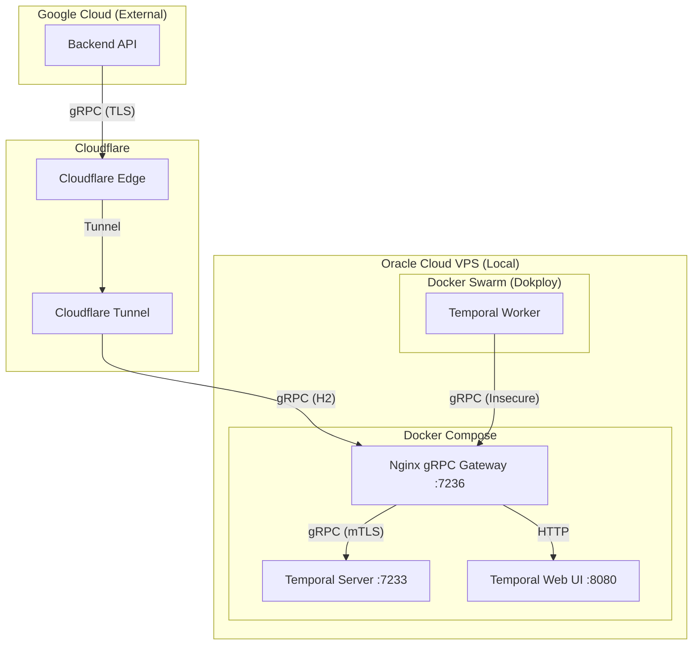

# Temporal Migration & Architecture Documentation

This document outlines the architecture, deployment strategy, and technical "gotchas" resolved during the migration of background background processing from BullMQ/node-cron to a self-hosted Temporal infrastructure.

## Architecture Overview

The system uses a hybrid cloud architecture to optimize costs and reliability.

- **Temporal Server:** Self-hosted on an **Oracle Cloud VPS** (Ubuntu ARM64) using Docker Compose.
- **Background Worker:** Deployed on the same **Oracle VPS** via **Dokploy** (Docker Swarm).
- **Backend API:** Deployed on **Google Cloud Run** (External to Oracle).
- **Connectivity:** Managed via **Cloudflare Tunnel** and an internal **Nginx gRPC Gateway**.



---

## Technical Solutions & Fixes

### 1. ARM64 / Oracle Ampere Compatibility
The Oracle VPS uses ARM64 architecture. The official Temporal Node.js SDK includes Rust-based C++ bindings (`@temporalio/core-bridge`).
- **Issue:** `Alpine Linux` (musl libc) failed to load these bindings on ARM64.
- **Fix:** Switched `Dockerfile` base image to `node:22-bookworm-slim` (Debian/glibc).
- **Dependency:** Installed `ca-certificates` manually as it's missing from the slim image but required for TLS verification.

### 2. Networking & IPv6 Bypass
Docker containers on Oracle Cloud often encounter `Network is unreachable` errors when attempting to resolve hostnames to IPv6 addresses.
- **Fix:** Implemented a manual DNS lookup in `core/TemporalManager.js` and `temporal-worker.js` that forces **IPv4 resolution** (`family: 4`) before establishing the gRPC connection.

### 3. Internal gRPC Gateway (mTLS Bridge)
The self-hosted Temporal server strictly requires mTLS for security. Managing client certificates inside every Dokploy container is difficult and brittle.
- **Solution:** Created an Nginx gateway on port `7236`.
- **Internal Workers:** Connect to `172.17.0.1:7236` (Host IP) via plain gRPC. Nginx handles the mTLS handshake to the Temporal server on their behalf.
- **External Clients (GCP):** Connect via `temporal.bishalbudhathoki.com:443`. Cloudflare Tunnel routes this to the same Nginx gateway.

### 4. Cloudflare gRPC Support
- **Issue:** Cloudflare Tunnel defaulted to HTTP/1.1, causing `502 Bad Gateway` for gRPC traffic.
- **Fix:** Enabled `http2Origin: true` in the Cloudflare Tunnel configuration.

---

## Deployment & Configuration

### Worker Environment Variables (Dokploy)
To ensure the worker connects correctly to the local VPS gateway:
```env
TEMPORAL_ADDRESS=172.17.0.1:7236
TEMPORAL_TLS=false
```

### API Environment Variables (GCP)
To connect securely from the external internet:
```env
TEMPORAL_ADDRESS=temporal.bishalbudhathoki.com:443
TEMPORAL_TLS=true
```

## Maintenance & Monitoring
- **Web UI:** [https://temporal.bishalbudhathoki.com](https://temporal.bishalbudhathoki.com) (Protected by Nginx Basic Auth).
- **Logs:** 
  - `docker logs temporal-nginx`
  - `docker service logs temporal-backend-xzhsod` (Worker)
  - `docker logs temporal-server`
